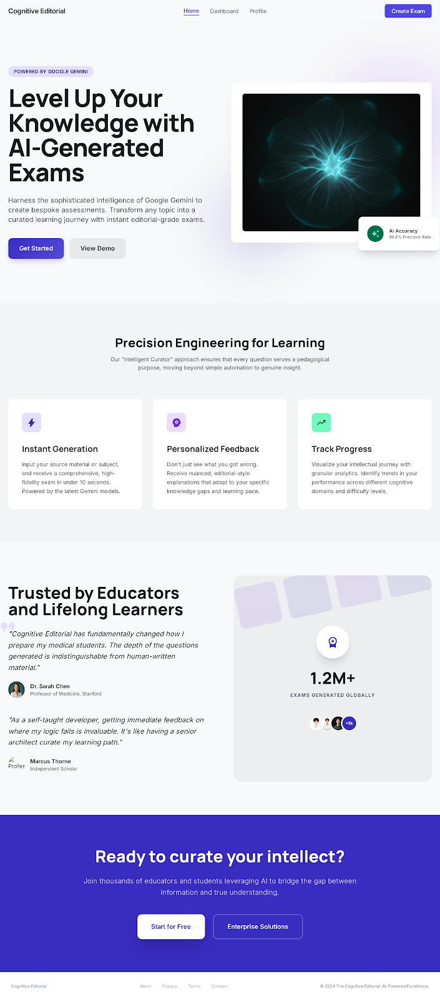
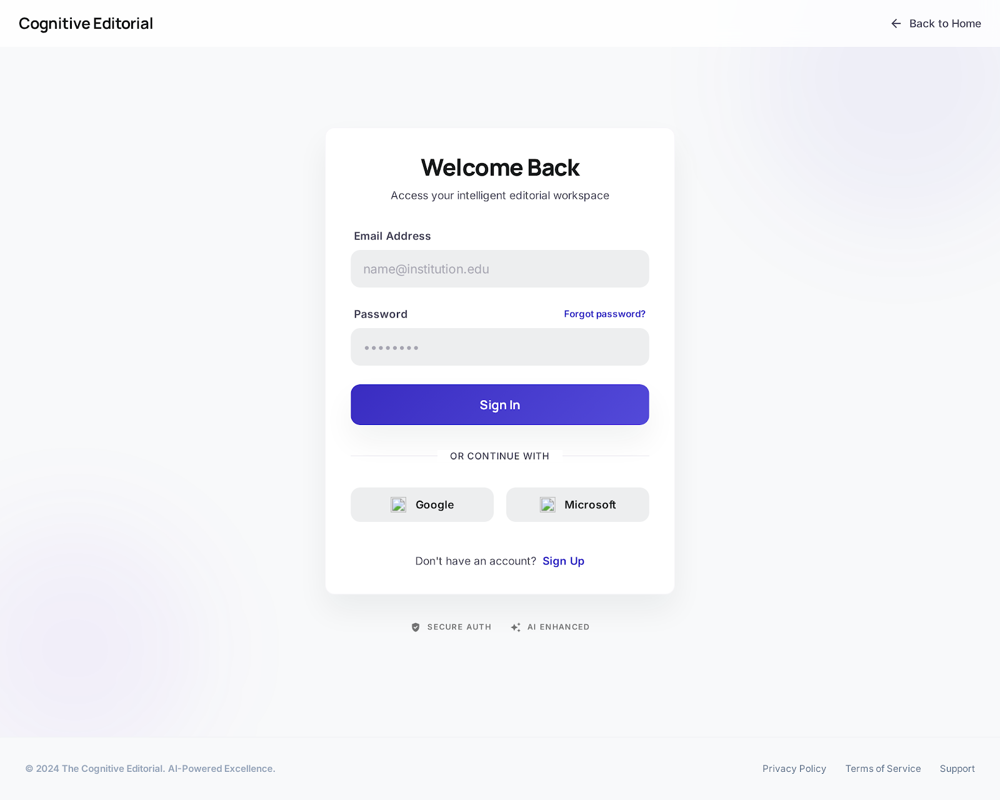
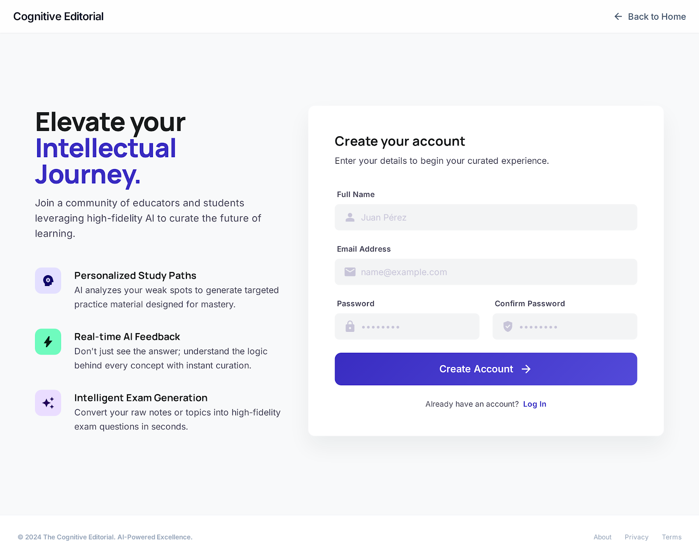
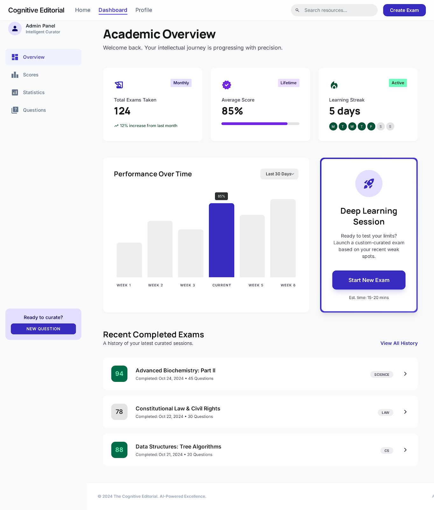
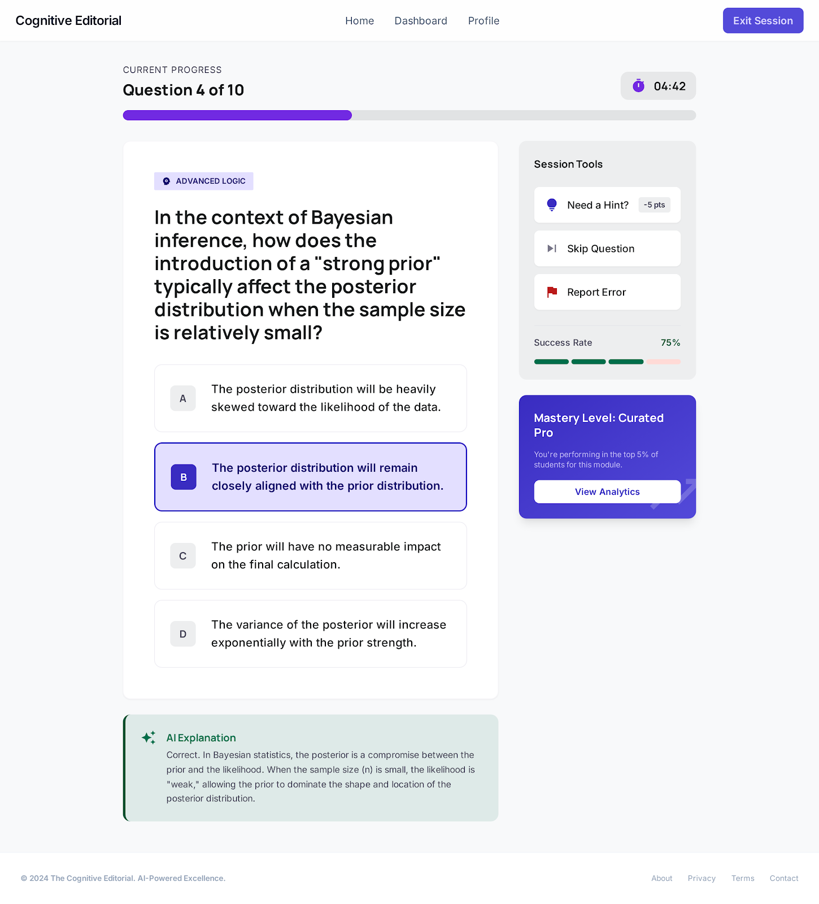
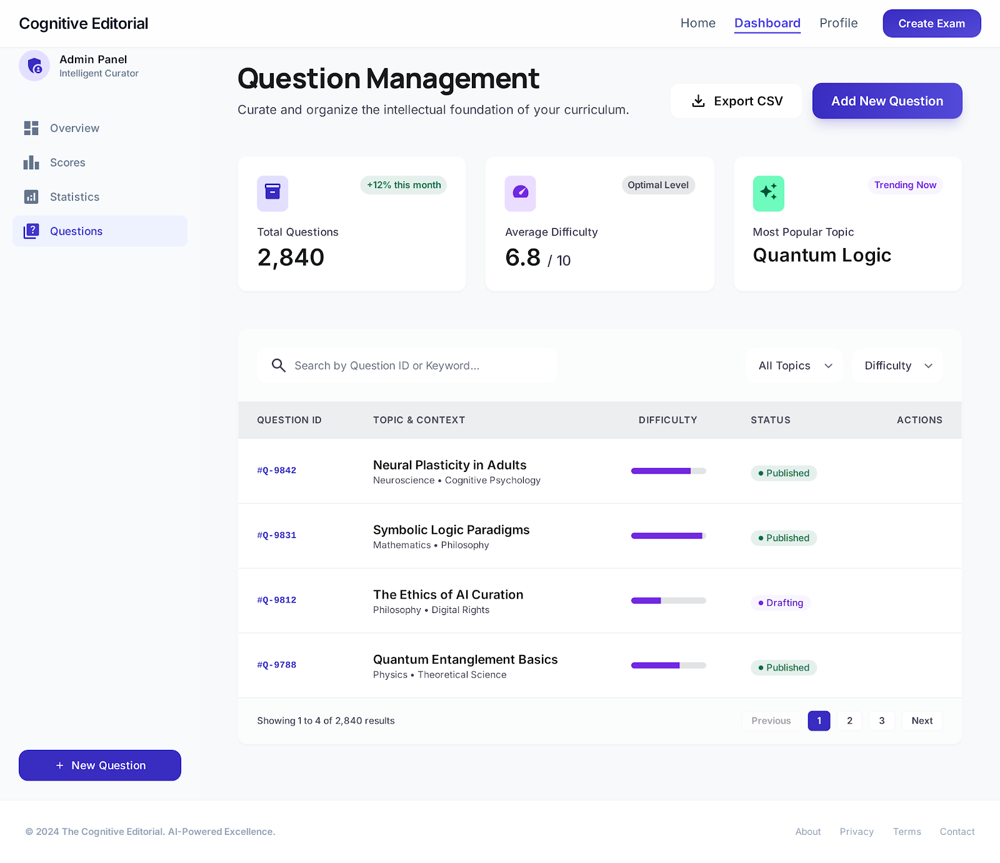

## Generador de examenes con IA

Proyecto realizado por Gael López Bautista y Erick Iván Valeriano Santiago del grupo 602-A
de la carrera Ingeniería en computación

# Descripcion del proyecto
Este proyecto es una aplicación web que funciona como un generador de exámenes interactivo. Su característica principal es la integración con la API de Google (Gemini) para generar y nutrir automáticamente un banco de preguntas y respuestas enfocado en el área de programación web. 

El sistema está respaldado por una base de datos encargada de almacenar de forma persistente todo el contenido de las evaluaciones. Para gestionar estos datos de manera eficiente, el proyecto implementa una API REST que expone operaciones CRUD para las preguntas y respuestas, así como un sistema de CRUD paralelo para administrar a los usuarios y registrar sus puntajes. 

A nivel de interfaz y seguridad, la aplicación requiere autenticación y cuenta con una página de login, lo que permite a cada usuario mantener un seguimiento personalizado de su desempeño y progreso en los exámenes.

## Rutas del Frontend

Estas son las direcciones URL a las que los usuarios accederán a través de su navegador.

* **`/` (Inicio)**: Landing page del proyecto.

Descripción: Pantalla de inicio que se verá al entrar a `localhost:3000`

* **`/login`**: Página de autenticación para usuarios registrados.

Descripción: Pantalla para iniciar sesión en tu cuenta

* **`/registrarse`**: Formulario para la creación de cuentas de nuevos usuarios.

Descripción: Pantalla para crear una cuenta

* **`/dashboard`**: Panel principal del usuario autenticado donde puede ver su información y puntaje acumulado.

Descripción: Pantalla para ver el rendimiento personal del usuario y puntuaciones

* **`/juego`**: Interfaz principal donde se muestran las preguntas generadas y el usuario interactúa para responderlas.

Descripción: Pantalla principal donde se mostrarán las preguntas y opciones de respuesta

* **`/admin`**: Panel de administración para gestionar la base de datos de preguntas de forma visual.

Descripción: Pantalla para gestionar las preguntas que se van generando con la API de Google Gemini.

## Rutas del Backend

La API manejará el flujo de datos en formato JSON para las distintas entidades del sistema.

### Autenticación
* **`POST /api/auth/registro`**: Recibe los datos del frontend y registra un nuevo usuario en la base de datos.
* **`POST /api/auth/login`**: Valida las credenciales del usuario y genera la sesión.

### Gestión de Usuarios y Puntaje
* **`GET /api/usuarios`**: Devuelve la lista de usuarios.
* **`GET /api/usuarios/:id`**: Obtiene la información detallada de un usuario en específico.
* **`PUT /api/usuarios/:id`**: Actualiza los datos de perfil de un usuario.
* **`DELETE /api/usuarios/:id`**: Elimina una cuenta de usuario.
* **`PATCH /api/usuarios/:id/puntaje`**: Actualiza de forma específica el puntaje de un usuario tras finalizar una sesión de examen.

### Gestión del Banco de Preguntas
* **`GET /api/preguntas`**: Devuelve las preguntas almacenadas en la base de datos.
* **`POST /api/preguntas`**: Permite la inserción manual de una nueva pregunta.
* **`PUT /api/preguntas/:id`**: Actualiza el texto o las respuestas de una pregunta existente.
* **`DELETE /api/preguntas/:id`**: Elimina una pregunta del banco.

### Integración con Google Gemini
* **`POST /api/preguntas/generar`**: Este endpoint se comunica directamente con la API de Google. Al ejecutarse, solicita la generación de una nueva pregunta sobre programación web, la formatea correctamente y la inserta en la base de datos para expandir el banco de preguntas disponible.